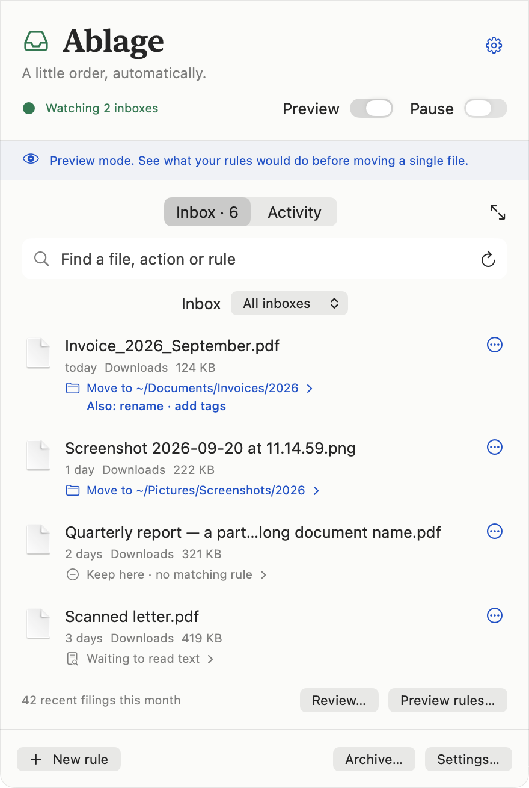

# Ablage

**A filing tray for your Mac.**

Ablage lives in the menu bar and helps you put files where they belong.
It watches Downloads by default. Add more inboxes, give each its own rules,
and review exactly where a file will go before moving it.

Your files stay in ordinary folders. No account, server, or subscription required.

<picture>
  <source media="(prefers-color-scheme: dark)" srcset="docs/images/inbox-dark.png">
  
</picture>

## What it does

- **Watch several inboxes.** Downloads, Desktop, scans, or another folder. Use shared rules or rules for one inbox.
- **Show the plan.** See the destination, new name, tags, and matching rule. Keep an inbox in Review first mode, or let its rules run automatically.
- **Read documents locally.** Search PDFs, Office documents, and text files. Recognize text in scans and images on your Mac.
- **Find identical files.** Compare folders, choose a copy to keep, and review the extras before sending them to Trash.
- **Search your archive.** Find documents by their contents, tags, sender, or date. Save useful searches.
- **Undo a filing.** Restore a file's location, name, and tags from Activity.

Also included: editable document details, searchable PDFs, scan splitting, email
attachment intake, and optional model assistance. [Read the guides →](docs/README.md)

## Build and install

Requires **macOS 14 or later** and Xcode Command Line Tools. To use Apple Intelligence,
build with the macOS 26 SDK and run on a supported Mac with Apple Intelligence enabled.
The rest of Ablage works without it.

```sh
xcode-select --install  # Skip if already installed.
git clone https://github.com/felixubl/ablage.git
cd ablage
make install
```

This builds Ablage locally, copies it to `/Applications`, and opens it. The build uses
your Apple Development signing identity if available, otherwise an ad-hoc signature.
There is no notarized download or automatic updater yet. [Build details](docs/development.md)

## Start with a preview

1. Click Ablage's tray icon in the menu bar.
2. Open **Settings → Inboxes** to choose folders, then **Rules** to adjust the examples.
3. Open **Review…** and inspect the proposed destinations.
4. Turn **Preview** off when you want actions to change files. Keep **Review first** on
   for any inbox where you want to approve each filing.

New installations start with Preview and Review first enabled. Existing configurations
are preserved. An unmatched file stays in its inbox.

[First-run guide](docs/getting-started.md) · [Rules and examples](docs/rules.md) ·
[Duplicate finder](docs/duplicates.md) · [Troubleshooting](docs/troubleshooting.md)

## Private by default

Rules, text recognition, search, learning, and duplicate detection run on your Mac.
Model assistance and email connections are optional. External models require an
explicit request or permission to run automatically.

The local index contains extracted document text; the activity log contains filenames
and paths. [Data storage, network access, and backups](docs/privacy.md)

## Status

Ablage is a young project. The interface is English; it does not yet follow your system
language. Inbox watching covers the direct contents of each folder. Archive indexing
and duplicate scans can include subfolders.

SSH/SFTP connections, stale-file suggestions, and identifying the current version of a
document are planned, not implemented. [Roadmap](docs/roadmap.md)

## Contributing

Bug reports, small fixes, and examples of useful rules are welcome.
[Contributing](CONTRIBUTING.md) explains how to build, test, and send a change.
For security problems, see [SECURITY.md](SECURITY.md).

## License

[MIT](LICENSE). Copyright © 2026 Felix Ubl.

Inspired by [Paperless-ngx](https://github.com/paperless-ngx/paperless-ngx)'s approach to
document filing. Ablage is a separate native Mac app. *Ablage* is German for a filing
tray or a place to put things away.
